### Touring the maze 

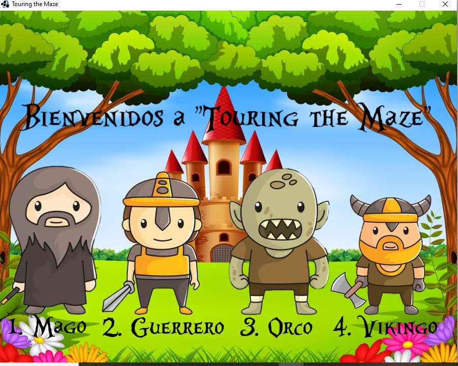

#### Grupo: Dream Team

Integrantes:

- Fuentes Matias
- Witkowski Alejandro
- Sciacca Lucia

#### El Juego:

El juego ,como su nombre lo indica, consiste en recorrer un laberinto, el jugador debe elegir 1 de los personajes para empezar el recorrido y sortear los diferentes obstaculos para pasar al siguiente nivel.

#### Personajes:

Los personajes son 4:

- 1- El Mago
- 2- El Guerrero
- 3- El Orco
- 4- El Vikingo

Ejemplo:
Si elegimos el nro 1, se abre una pantalla con las instrucciones de las teclas habilitadas con la imagen del personaje elegido

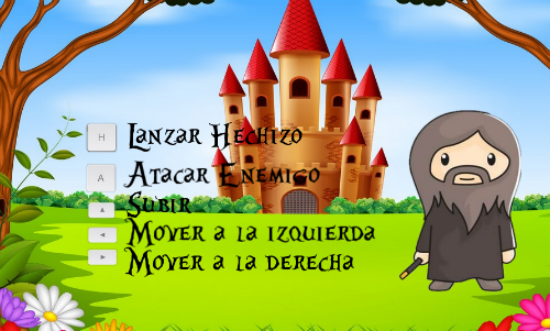

Unos segundos despúes ya ingresamos al escenario del juego:

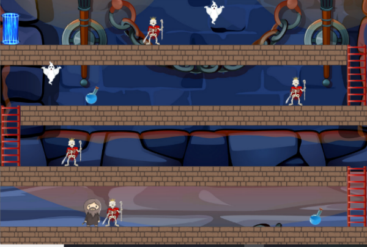

#### Obstaculos:
 
- Esqueletos:
El primero que nos encontramos son los esqueletos, éstos se atacan pulsando la tecla "a", en el caso del mago 5 veces, en los demás personajes 2 veces. Ojo si chocas contra ellos varias veces te van a matar.

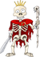

- Fantasmas:
Hay unos fantasmitas que mejor perderlos que encontrarlos porque si chocas con ellos te matan y se termina el juego.

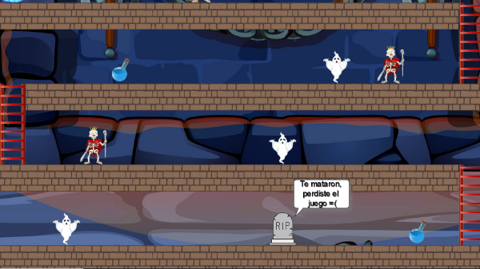

#### Premios:

Hay en algunas de las plataformas unas pociones azules llamadas "mana" sirve para que los personajes sumen energia para tener ciertas habilidades.

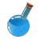

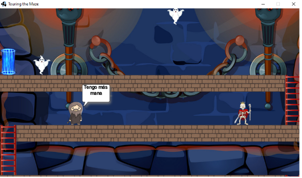

#### Habilidades:

Estas habilidades dependen de cada personaje y se lanzan con la tecla "h":

- Mago: la habilidad del mago es lanzar una bola mágica que aleatoriamente va por todo el laberinto hasta que mata a un esqueleto y desaparece.

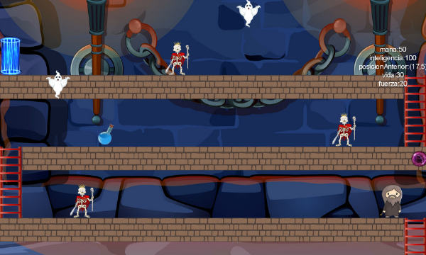

- Guerrero: la habilidad del guerrero es sumar salud 

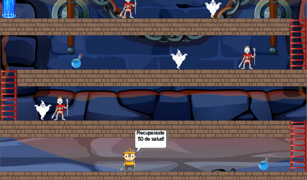

- Orco: la habilidad del orco es saltar a la plataforma siguiente

- Vikingo: la habilidad del vikingo es lanzar un hacha para matar el esqueleto de la plataforma

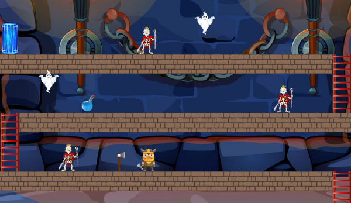

#### Pasar de Nivel:

Una vez sorteados todos los obstaculos se llega al final del nivel 1 

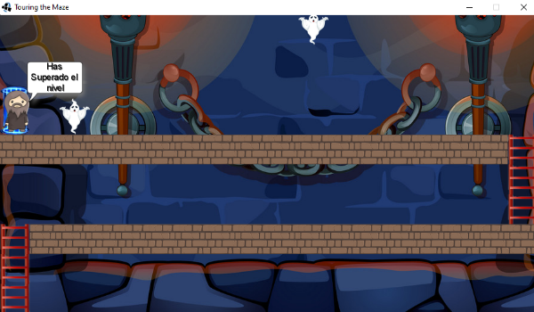

#### Nivel 2 y fin de Juego:

Luego de unos segundos se pasa al nivel 2, que esta en construccion,( ojo que hay fantasmitas rondando ) y se llega al final del juego

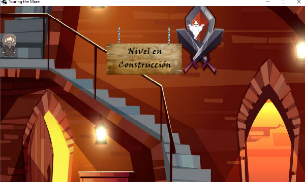

